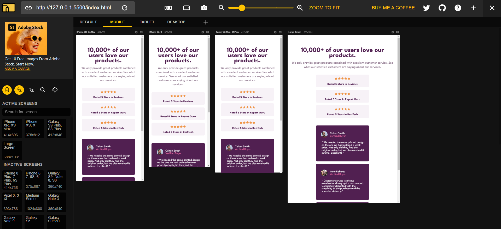

## Table of contents

- [Overview](#overview)
  - The challenge is to build out this interactive comment's page of a company.
  - My process: It took me 4 days to build this.
  - Built with: HTML5 and CSS3.
  - What I learned: I've learned how to manipulate a elements with css.
  - Continued development: I have to continue practice how to manipulate DOM, elements and mobilefirst. 
- Author: Natali Marinho. 
- Acknowledgments: javascript, css and html.
- Deploy: https://natsmarinho.github.io/social-media-proof/

### Screenshot

### Built with

- Semantic HTML5 markup
- CSS custom properties
- Flexbox

## Author

- Frontend Mentor - [@natsmarinho](https://www.frontendmentor.io/profile/natsmarinho)
- Twitter - [@natsmarinho](https://www.twitter.com/natsmarinho)
- Instagram - [@natsmarinho](https://www.instagram.com/natsmarinho/)

